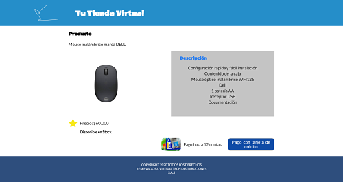
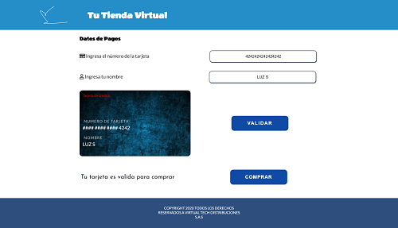
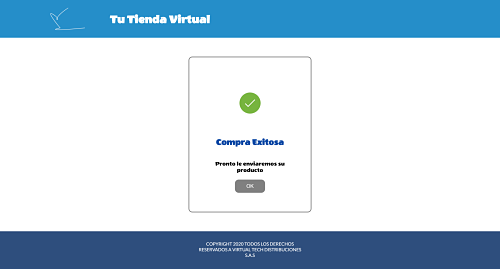
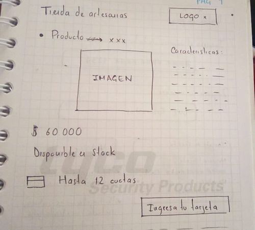
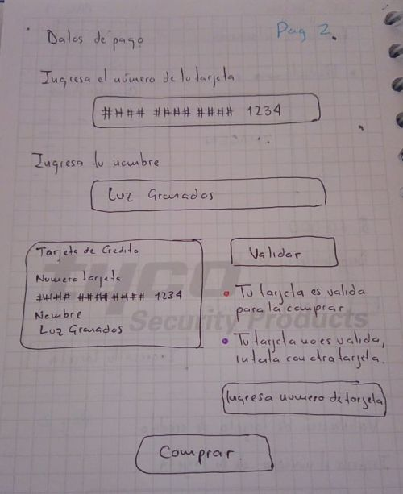
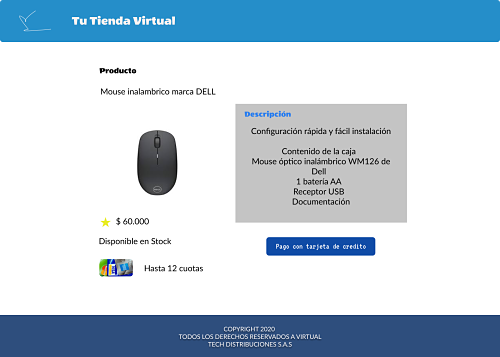
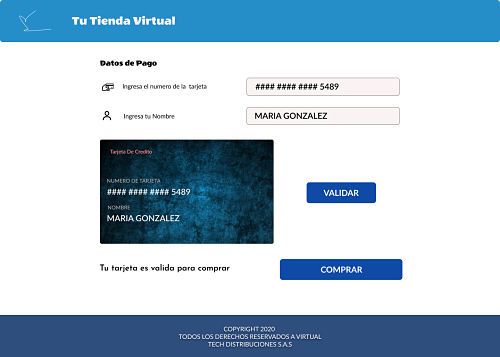

# Proyecto Validación Tarjeta de Credito - Tu Tienda Virtual 💳

##### Resumen

En este proyecto se simulo una tienda virtual, donde el usuario realiza la compra de un producto por medio de tarjeta de credito, como punto importante se realizó la validacion para saber si la tarjeta es valida o no utilizando el algoritmo de luhn, ademas se enmascaro el numero de la tarjeta dejando visible solo los ultimos cuatro digitos.

* Visualizacion del proyecto:

* Investigación UX 👩👨

  1. Nuestros usuarios son compradores que cuenten con una tarjeta de credito para realizar el pago de los productos.
  2. Nuestro proyecto satisface la necesidad de los usuarios que quieran adquirir un producto por medio de una tienda virtual, nos aseguramos de que fuera fácil la navegación por la página y que fuera entendible.
  3. El sketch realizado fue el siguiente:

  4. Entre las mejoras recibidas en el feedback, se pedia ocultar la imagen de la tarjeta de credito hasta que el usuario diligenciara los datos solicitados. De acuerdo a esto se decidio mostrar el boton de "Validar" hasta que el usuario diligenciara el número de tarjeta y el nombre.
  5. El prototipo final se realizo en Figma:

## Visualizacion del proyecto en Github Pages 💻

 [Accede aqui](https://sthephany04.github.io/BOG001-card-validation/)

## Objetivos de aprendizaje obtenidos 📕

#### UX

* [x] Diseñar la aplicación pensando y entendiendo al usuario
* [x] Crear prototipos para obtener feedback e iterar
* [x] Aplicar los principios de diseño visual

#### HTML y CSS

* [x] Uso correcto de HTML semántico
* [x] Uso de selectores de CSS
* [x] Construir tu aplicación respetando el diseño realizado (maquetación).

#### DOM

* [ ] Uso de selectores de nodos del DOM 
* [x] Manejo de eventos del DOM
* [x] Manipulación dinámica del DOM 

#### Javascript

* [x] Manipulación de strings
* [x] Uso de condicionales
* [x] Uso de bucles
* [x] Uso de funciones
* [ ] Datos atómicos y estructurados
* [x] Utilizar ES Modules (`import` | `export`).

#### Testing

* [x] Testeo de tus funciones

#### Git y GitHub

* [x] Comandos de git (`add` | `commit` | `pull` | `status` | `push`).
* [x] Manejo de repositorios de GitHub (`clone` | `fork` | `gh-pages`).

#### Buenas prácticas de desarrollo

* [x] Organizar y dividir el código en módulos (Modularización).
* [x] Uso de identificadores descriptivos (Nomenclatura | Semántica).
* [x] Uso de linter para seguir buenas prácticas (ESLINT).

